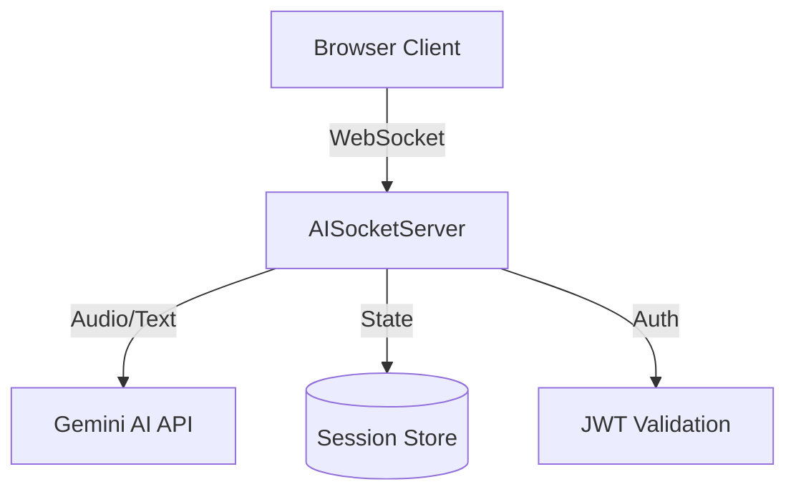

# JDLabs AI Interview Platform - AI Agent Instructions

## Architecture Overview

### Core Components & Data Flow


## Project Overview
JDLabs is a React-based AI interview platform that supports multiple interview modes (video, audio, chat, and live share) using Google's Gemini AI API and Supabase for data storage. The platform implements a sophisticated WebSocket-based audio pipeline for real-time AI interviews.

### Key Services
- `aiSocketServer.ts`: WebSocket server handling real-time interview sessions
  - Manages audio transcoding, rate limiting, and session state
  - Uses dual Gemini SDKs for text/audio generation
- `geminiService.ts`: Wrapper for Gemini AI APIs
  - Handles both text and audio interactions
  - Provides fallback mechanisms for audio generation failures
- `audioUtils.ts`: Audio processing utilities
  - Handles base64⟷buffer conversions
  - Provides FFmpeg-based audio transcoding
- `InterviewScreen.tsx`: Main interview interface
- `useBackendSocket.ts`: WebSocket client hook

### Data Flow
1. Client Media Capture → WebSocket chunks
2. Server Audio Processing → Gemini AI
3. AI Generation → Audio/Text Response
4. Response Streaming → Client Playback

## Development Workflows

### Environment Setup
1. Required Environment Variables:
```bash
GEMINI_API_KEY=your_key
JWT_SECRET=your_secret        # For WebSocket auth
ALLOWED_ORIGINS=http://localhost:3000,https://your-domain.com
```

2. Install FFmpeg for audio processing:
```bash
# Windows (using chocolatey)
choco install ffmpeg

# Mac
brew install ffmpeg

# Linux
apt-get install ffmpeg
```

### Common Development Tasks

#### Adding New Message Types
1. Define types in `types.ts`
2. Add handler in `aiSocketServer.ts` message processing
3. Update client hook in `useBackendSocket.ts`

Example from `aiSocketServer.ts`:
```typescript
else if (data.type === 'audio-chunk') {
    // 1. Validate chunk
    if (!validateAudioChunk(data)) {
        return sendError(client, 'INVALID_AUDIO');
    }
    // 2. Process audio
    const response = await this.gemini.sendAudioToGemini(...);
    // 3. Send response
    client.send(JSON.stringify({
        type: 'audio-response',
        sessionId,
        seq: data.seq,
        // ... response data
    }));
}
```

### Testing & Debugging

#### WebSocket Testing
- Use Chrome DevTools Network tab with WS filter
- Watch for these log markers:
  ```
  🟢 New client connected
  📨 Received message
  🎤 Processing audio
  🔴 Client disconnected
  ```

#### Audio Pipeline Testing
Test audio processing chain:
1. Send test audio chunk:
   ```typescript
   ws.send(JSON.stringify({
     type: 'audio-chunk',
     data: base64AudioData,
     encoding: 'wav',
     sampleRate: 16000
   }));
   ```
2. Check server logs for transcoding
3. Verify Gemini API response
4. Confirm client receives audio playback

### Project-Specific Patterns

#### Error Handling
- All errors must be structured:
  ```typescript
  {
    type: 'error',
    code: 'ERROR_CODE',
    message: 'Human readable message',
    recoverable: boolean
  }
  ```

#### Rate Limiting
- Audio chunks: 30 requests/minute
- Session timeouts: 5 minutes inactive
- Implement backoff when approaching limits

#### Audio Processing
- Input: Accept WAV/Opus/WebM
- Internal: Convert to 16kHz mono WAV
- Output: Generate Opus format
- Maximum chunk size: 5MB

## Common Pitfalls

1. **WebSocket Setup**
   - Always handle connection errors
   - Implement reconnection logic
   - Verify origin headers

2. **Gemini API**
   - Handle both SDKs correctly:
     - `@google/generative-ai`: Text generation
     - `@google/genai`: Audio generation
   - Check response formats differ between SDKs

3. **Audio Processing**
   - Validate audio chunks before processing
   - Always clean up temp files
   - Handle FFmpeg errors gracefully

## Integration Points

1. **Frontend → WebSocket**
   - Entry: `useBackendSocket` hook
   - Message format must match server exactly
   - Handle binary audio data correctly

2. **WebSocket → Gemini**
   - Use appropriate SDK for mode
   - Handle streaming responses
   - Implement fallbacks

3. **Error Propagation**
   - Log errors server-side
   - Send structured errors to client
   - Maintain audit trail

## Project Structure
- `/components`: React components
- `/services`: API and backend services
- `/hooks`: Custom React hooks
- `/constants`: Configuration and constants
- `/contexts`: React context providers
- `/docs`: Documentation and guides